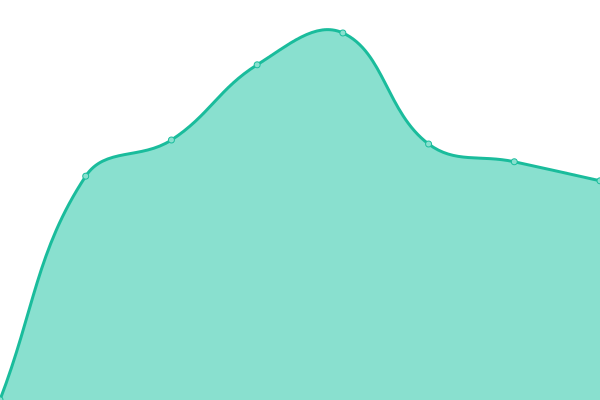
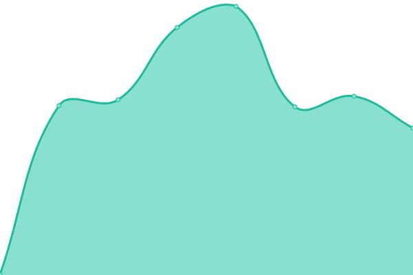
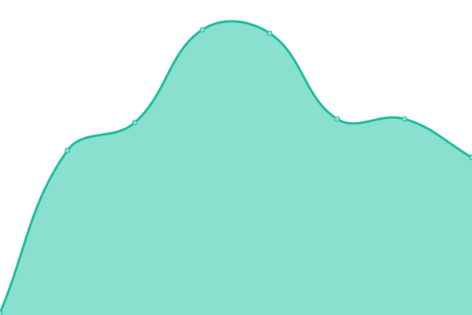

# [📈 Live Status](https://upptime.github.io/upptime): <!--live status--> **🟩 All systems operational**

This repository contains the open-source uptime monitor and status page for [Upptime](https://upptime.js.org), powered by [Upptime](https://github.com/upptime/upptime).

With [Upptime](https://upptime.js.org), you can get your own unlimited and free uptime monitor and status page, powered entirely by a GitHub repository. We use [Issues](https://github.com/upptime/upptime/issues) as incident reports, [Actions](https://github.com/TwenixPlatform/twenix-status/actions) as uptime monitors, and [Pages](https://upptime.github.io/upptime) for the status page.

<!--start: status pages-->
<!-- This summary is generated by Upptime (https://github.com/upptime/upptime) -->
<!-- Do not edit this manually, your changes will be overwritten -->
<!-- prettier-ignore -->
| URL | Status | History | Response Time | Uptime |
| --- | ------ | ------- | ------------- | ------ |
|  [Twenix Portal](https://www.twenix.com) | 🟩 Up | [twenix-portal.yml](https://github.com/TwenixPlatform/twenix-status/commits/HEAD/history/twenix-portal.yml) | 

 1982ms
     
 | 

<a href="https://status.twenix.com/history/twenix-portal">100.00%</a>
    

|  [Twenix Students](https://platform.twenix.com/auth/login) | 🟩 Up | [twenix-students.yml](https://github.com/TwenixPlatform/twenix-status/commits/HEAD/history/twenix-students.yml) | 

 509ms
     
 | 

<a href="https://status.twenix.com/history/twenix-students">100.00%</a>
    

|  [Twenix Teachers](https://teacher.twenix.com/auth/login) | 🟩 Up | [twenix-teachers.yml](https://github.com/TwenixPlatform/twenix-status/commits/HEAD/history/twenix-teachers.yml) | 

 492ms
     
 | 

<a href="https://status.twenix.com/history/twenix-teachers">100.00%</a>
    

|  [Twenix Backend](https://platform.twenix.com/api/alive) | 🟩 Up | [twenix-backend.yml](https://github.com/TwenixPlatform/twenix-status/commits/HEAD/history/twenix-backend.yml) | 

 123ms
     
 | 

<a href="https://status.twenix.com/history/twenix-backend">100.00%</a>
    

<!--end: status pages-->

[**Visit our status website →**](https://upptime.github.io/upptime)

## 📄 License

- Powered by: [Upptime](https://github.com/upptime/upptime)
- Code: [MIT](./LICENSE) © [Upptime](https://upptime.js.org)
- Data in the `./history` directory: [Open Database License](https://opendatacommons.org/licenses/odbl/1-0/)
